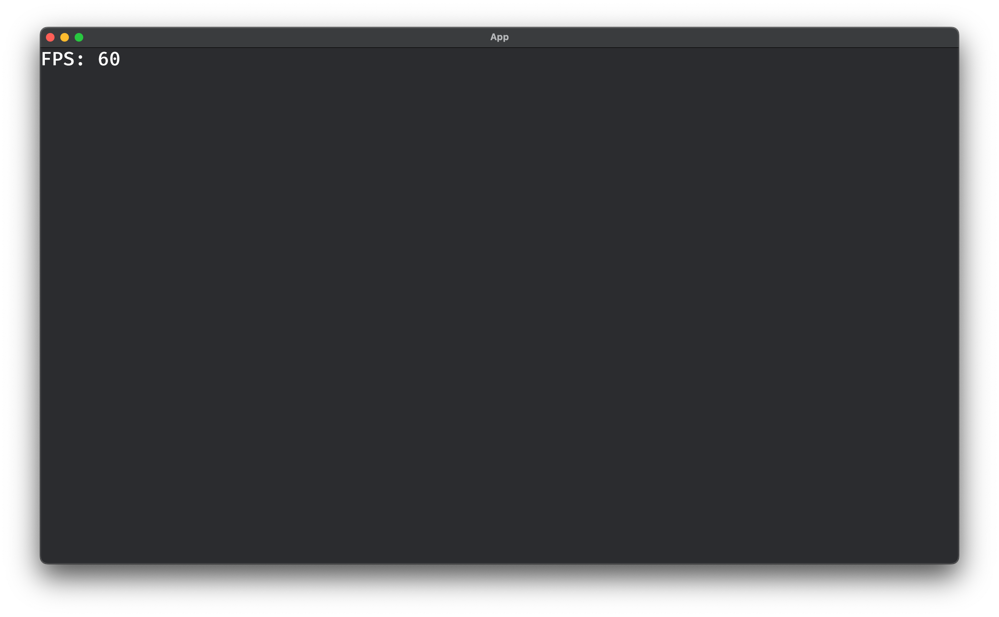

# Bevy FPS Counter

A simple FPS counter plugin for the [Bevy game engine](https://bevyengine.org/).

## Install

Command:

```sh
cargo add bevy-fps-counter
```

Cargo.toml:

```toml
[dependencies]
bevy-fps-counter = "*"
```

## Usage

> See [examples](examples)

### Basic

You can see comparison with MangoHud on the right


