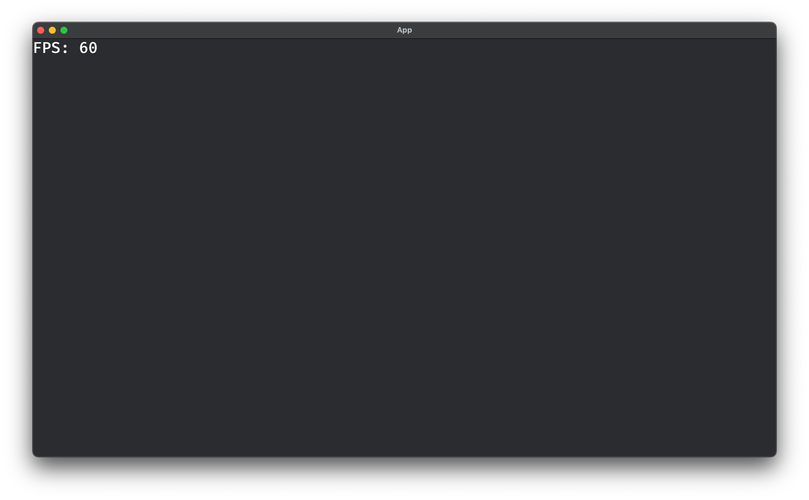

# Bevy FPS Counter

A simple FPS counter plugin for the [Bevy game engine](https://bevyengine.org/).

## Install

Command:

```sh
cargo add bevy-fps-counter
```

Cargo.toml:

```toml
[dependencies]
bevy-fps-counter = "*"
```

## Usage

> See [examples](examples)

### Basic



## Versions compatibility

| `bevy-fps-counter` | `bevy` |
| ------------------ | ------ |
| `0.9.0`            | `0.18` |
| `0.8.0`            | `0.17` |
| `0.7.0`            | `0.16` |
| `0.6.0`            | `0.15` |
| `0.5.0`            | `0.14` |
| `0.4.0`            | `0.13` |
| `0.3.0`            | `0.12` |
| `0.2.0`            | `0.11` |
| `0.1.0`            | `0.10` |
